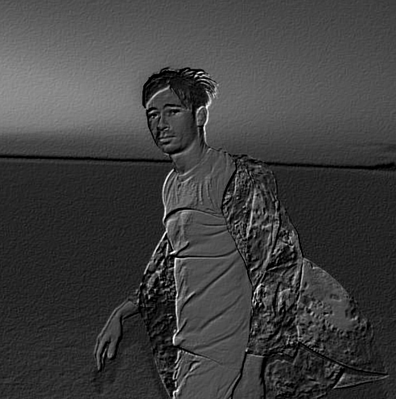

# Imagefilters
Python script that applies filters to images using convolution kernels

## Usage
`python imagefilters.py <path-to-image> <filters>`

- you can pass any number of filters. Supported filters include small_blur, large_blue, sharpen, laplacian, sobel_x and sobel_y, emboss
- make sure you have scikit-image and opencv packages installed 

#### original

#### emboss
  

